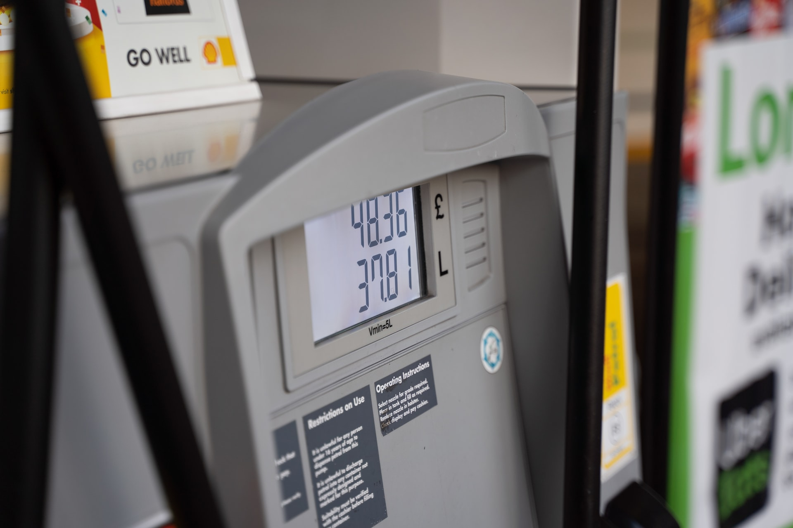

```{r setup, include=FALSE}
knitr::opts_chunk$set(echo = FALSE, message = FALSE, warning = FALSE)
```

```{r grassmarket, fig.margin = TRUE, echo = FALSE, warning=FALSE, message=FALSE, fig.width=3, fig.cap="Foto de Krzysztof Hepner em Unsplash"}

library(Deriv)
library(tidyverse)
library(readxl)
library(directlabels)
library(cowplot) # for arranging plots


```

# Mercado das Refinerias de Gasolina

1.  Considere os dados de uma empresa produtora de gasolina (refineria) (Painel A), além das curvas agregadas de Oferta ($P = 1+0,15Q$) e Demanda ($P=10-0,12Q$) do painel B. Com base na Teoria da Produção, qual é o preço e quantidade de equilíbrio da empresa?

```{r}

demanda <- function(q) 10 - (0.12*q)
oferta <- function(q) 1 + (0.15*q)

dados <- data.frame(q= c(0:140))

dados <- dados %>% 
  mutate(demanda = demanda(q),
         oferta = oferta(q))

mercado_long<- dados %>% 
  pivot_longer(-q, names_to = "curves", values_to = "price") %>% 
  mutate(tipo="Mercado")

PLOT01 <- mercado_long %>% 
  ggplot(aes(q, price, color=curves))+
    geom_line(size=1.2)+
  xlim(0,100)+
  scale_y_continuous(limits= c(0,10),
                     breaks=seq(0,10, by=1))+
  theme_bw()+
  geom_dl(aes(label = curves), method = "smart.grid")+
  labs(y="Preço (R$ por litro)",
       x="Milhões de litros/dia",
       subtitle="Curvas do Mercado")+
  theme(axis.text=element_text(size=12),
        axis.title=element_text(size=10, face="bold"),
        legend.position = "none")

# Graficando a função de custos

custos <- read_excel("/Users/mauricio/Dropbox/mauricio/UFSC/01_GRAD/2020/2020.2/EPS 5222/Aula 08/custos_com_dados.xlsx", 
    sheet = "Sheet 1",
    skip = 1)

custos$CMg <- as.numeric(custos$CMg)

custos <- custos %>% rename(q=Produção)

custos_long <- custos %>% 
  select(4,8,9,10,11) %>% 
  filter(q <= 140) %>% 
  pivot_longer(2:5, names_to="curves", values_to="price") %>% 
  mutate(tipo="Empresa")
  
PLOT02 <- custos_long %>%  
  ggplot(aes(q, price, color=curves))+
  geom_smooth(se=FALSE)+
  labs(y="Preço (R$ por litro)",
       x="Milhares de litros/dia",
       subtitle="Custos da Empresa")+
  theme_bw()+
  geom_dl(aes(label = curves), method = "smart.grid")+
  scale_y_continuous(limits= c(0,10),
                     breaks=seq(0,10, by=1))+
  scale_x_continuous(limits= c(0,140),
                     breaks=seq(0,140, by=20))+
  theme(axis.text=element_text(size=12),
        axis.title=element_text(size=10, face="bold"),
        legend.position = "none")

# resultado final

plot_grid(PLOT02, PLOT01, labels = c("A", "B"), ncol = 2, nrow =1, label_size = 8)

```

```{r, eval=FALSE}
#Custos com splinefun como outra aternativa para suavizar as curvas de custos
CMg_fun <- splinefun(x=custos$Produção, y=custos$CMg)
CVMe_fun <- splinefun(x=custos$Produção, y=custos$CVMe)
CTMe_fun <- splinefun(x=custos$Produção, y=custos$CTMe)
CFMe_fun <- splinefun(x=custos$Produção, y=custos$CFMe)

ggplot(data = tibble(x = 0:150), aes(x = x)) +
  geom_function(fun = CMg_fun, aes(color="CMg"), 
                size=1.2)+
  geom_function(fun = CVMe_fun, aes(color="CVMe"),
                size=1.2)+
  geom_function(fun = CTMe_fun, aes(color="CTMe"),
                size=1.2)+
  geom_function(fun = CFMe_fun, aes(color="CFMe"),
                size=1.2)+
  theme_bw()+
  scale_y_continuous(limits= c(0,10),
                     breaks=seq(0,10, by=1))

```

2.  Qual é o Lucro da empresa neste ponto de equilíbrio? Use um gráfico em complemento com a explicação.
3.  O que irá acontecer neste mercado no longo prazo? use um gráfico para ajudar na explicação
4.  Assuma que o mercado se encontra em equilíbrio de longo prazo. Utilize a teoria da produção para demonstrar o impacto da entrada de empresas estrangeiras no mercado, levando a um novo preço de equilíbrio de mercado de R\$ 4,50. Qual será o novo equilíbrio (preço e quantidade) para a empresa?
5.  Quais são os lucros da empresa neste novo preço?
6.  De acordo com a sua resposta à questão anterior, como as empresas se comportarão no curto prazo? As empresas continuarão operando no curto prazo?

Observação: pode reproduzir todos os dados do gráfico (Painel A), com base na Tabela a seguir (onde: `q` em milhares de litros por dia, `L` em milhares de trabalhadores e os custos `CV` e `CF` em milhares de R\$ por dia):

```{r}
library(kableExtra)

custos %>% 
  rename(CF = "Custo Fixo",
         L = "N. De trabalhadores") %>% 
  select(1,4,5,6) %>% 
  kbl() %>% 
  kable_styling()
  

```

