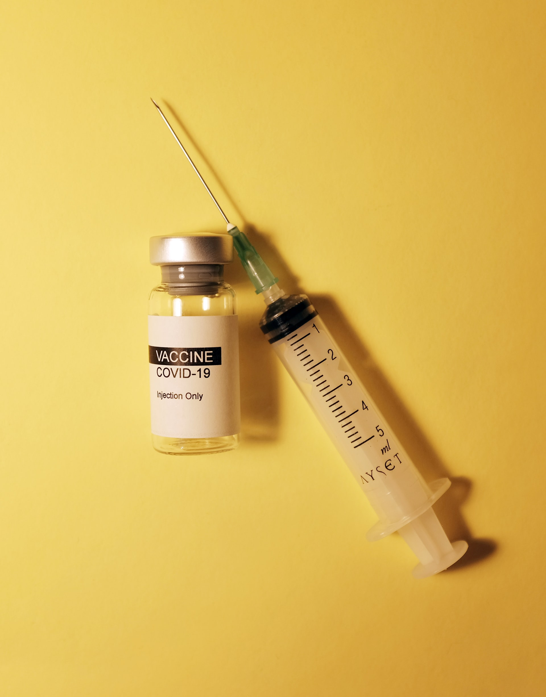

```{r setup, include=FALSE}
knitr::opts_chunk$set(echo = TRUE)
```

# Externalidades e incentivos: a visão microeconômica do Covid-19

```{r nc, fig.margin = TRUE, echo = FALSE, fig.width=3, fig.cap="Foto de Hakan Nural em Unsplash"}

```

Assista ao vídeo a seguir: "Externalidades e Incentivos: A Economia da COVID", e pause o vídeo às 3:47 para responder as perguntas abaixo.

```{marginfigure}
*Dica:* Para legendas em português, assista: https://www.youtube.com/watch?v=QYuVx8y2reU 
```

[Link para vídeo no Youtube](https://www.youtube.com/watch?v=2EFG6dvtQ6M "Economics of Covid-19")

1.  Resuma em suas próprias palavras porque uma vacina contra gripe é um exemplo de uma externalidade positiva.

2.  Identifique 1-2 outras atividades/bens/serviços com externalidades positivas.

3.  Dada a definição de uma externalidade positiva, você pode prever a definição de uma externalidade negativa?

4.  Grafique os benefícios de um indivíduo que recebe uma vacina contra a gripe? **Dica:** você deve identificar os benefícios internos e externos.

5.  O apresentador afirma que o número de pessoas que tomam vacinas contra a gripe é menor do que o número socialmente ideal de vacinas contra a gripe? Por quê?

6.  Quais são as duas formas de aumentar o número de pessoas que recebem vacinas contra a gripe?

7.  Explique como o desenvolvimento de vacinas contra o coronavírus também é um exemplo de uma externalidade positiva.

8.  Considerando que, sem algum tipo de intervenção, o desenvolvimento de vacinas também seria subprovido, quais são algumas soluções possíveis para incentivar o desenvolvimento de vacinas?

9.  Das soluções que você identificou, quais são as mais viáveis?

10. Agora assista o restante do vídeo: várias vacinas já foram desenvolvidas para o Covid-19, com eficácias comprovadamente altas e de acordo a muitos especialistas, numa velocidade nunca antes vista na história. Por que a velocidade para obter uma ou várias vacinas eficazes é tão importante quanto o fato delas serem eficazes?


**Dica:** Pense do ponto de vista de uma única farmaceutica (ou grupo) desenvolvendo sua própria vacina, p.ex a da Astra Zeneca.


